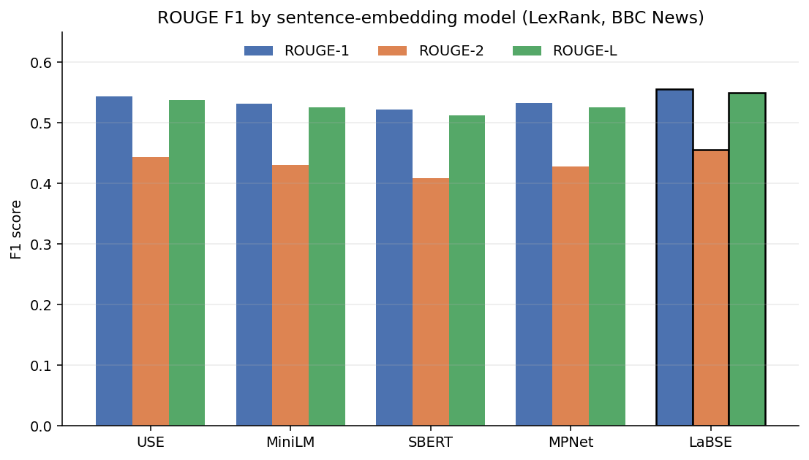
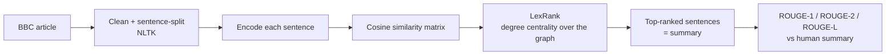

# 📰 Comparative Study of Sentence Embedding Techniques on News Summarization

Which sentence encoder should sit underneath a graph-based extractive summariser? This study holds
the algorithm fixed — **LexRank** — and swaps the sentence representation five ways, scoring every
generated summary against the human reference with ROUGE. Across 2,225 BBC News articles,
**LaBSE** comes out ahead.


## Overview

Extractive summarisation picks sentences out of the source document rather than writing new ones.
LexRank does the picking: build a graph whose nodes are sentences and whose edge weights are
cosine similarities between sentence vectors, then rank nodes by degree centrality and take the
top ones.

Every part of that procedure runs on the sentence vectors — so the vectors are the variable worth
isolating, and the algorithm is held constant to isolate them.

## Models Compared

| Model | Checkpoint |
| --- | --- |
| **Universal Sentence Encoder (USE)** | `tfhub.dev/google/universal-sentence-encoder-large/5` |
| **Sentence-BERT** | `bert-base-nli-mean-tokens` |
| **MPNet** | `all-mpnet-base-v2` |
| **MiniLM** | `all-MiniLM-L6-v2` |
| **LaBSE** | `sentence-transformers/LaBSE` |

## Results

Best average F1 across all 2,225 articles, achieved by **LaBSE**:

| Metric | LaBSE F1 |
| --- | --- |
| ROUGE-1 | **0.5558** |
| ROUGE-2 | **0.4553** |
| ROUGE-L | **0.5501** |



> ROUGE scores for all five encoders. LaBSE and USE lead on every metric, with LaBSE ahead.

Broken down by domain, both leaders do their best work on **sport** and **business** articles.
That is worth reading as a property of the method rather than of the encoders: LexRank rewards
centrality, so it performs best exactly where the important sentences are also the most
representative ones. On articles whose key sentence is an outlier — a single surprising fact in an
otherwise ordinary piece — centrality ranks it low and the summariser misses it, no matter which
encoder supplies the vectors.

## How It Works



**1. Preprocessing.** Articles are stripped of stray characters and whitespace and split into
sentences with NLTK.

**2. Encoding.** Each sentence becomes a dense vector from one of the five encoders. This is the
only step that changes between runs.

**3. LexRank.** A similarity graph is built from pairwise cosine similarities, and sentences are
ranked by degree centrality — a sentence scores highly when it is similar to many other sentences,
weighted by how highly *those* sentences score.

**4. Evaluation.** Generated summaries are compared against the human-written references with
ROUGE-1 (unigram overlap), ROUGE-2 (bigram overlap) and ROUGE-L (longest common subsequence),
reported per domain and averaged.

## Tech Stack

- **Language**: Python
- **Embeddings**: sentence-transformers, TensorFlow Hub
- **NLP**: NLTK
- **Evaluation**: ROUGE (sumeval)
- **Analysis**: pandas, NumPy, Matplotlib
- **Environment**: Jupyter Notebook, Google Colab

## Repository Structure

```
Comparative-Study-of-Sentense-Embedding-Techniques-on-News-Summarization/
├── notebooks/
│   └── summarization_comparison.ipynb   # encoders, LexRank, ROUGE scoring, per-domain analysis
├── Dataset/
│   └── BBC News Summary.zip             # 2,225 articles with human summaries
├── docs/
│   ├── Report.pdf                       # full paper
│   └── Poster.pptx                      # project poster
├── assets/                              # figures used in this README
├── DATASET.md                           # dataset structure and statistics
├── README.md
└── LICENSE
```

## Running the Project

```bash
pip install sentence-transformers tensorflow tensorflow-hub nltk sumeval pandas matplotlib
jupyter notebook notebooks/summarization_comparison.ipynb
```

Unzip `Dataset/BBC News Summary.zip` alongside the notebook first. The notebook was written for
Google Colab, so update the Drive-mount path if you run it locally.

> The first run downloads all five encoder checkpoints — several GB in total, USE being the
> largest.

## Dataset

**BBC News Summary** — 2,225 articles across five domains, each with a human-written extractive
summary. Structure and statistics are in [DATASET.md](DATASET.md).

## Future Scope

- Compare against abstractive summarisers (BART, PEGASUS) on the same corpus.
- Test whether a domain-tuned encoder beats a general one on the weaker domains.
- Try alternative graph rankings — TextRank, or centrality measures other than degree.

## Acknowledgments

Course project at **Amrita School of Engineering, Bengaluru** (Amrita Vishwa Vidyapeetham),
guided by Dr. Deepa Gupta, by Vishnu Sainadh Kedarisetty, Satwik Kukkadapu and Ashrith Vadde.

## Documentation

- 📄 [Project Report](docs/Report.pdf)
- 📊 [Poster](docs/Poster.pptx)
